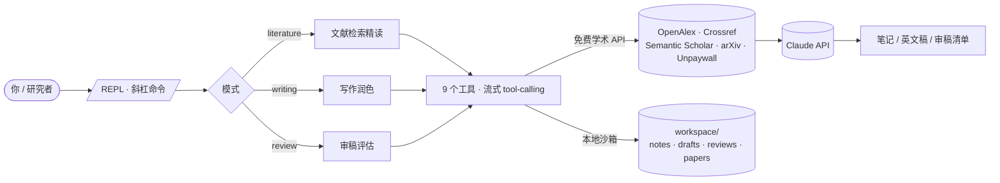

<p align="center">
  
</p>

<p align="center">
  <a href="LICENSE"></a>
  <a href="https://www.python.org/"></a>
  <a href="https://github.com/1844514356zjc-dev/research-agent/actions/workflows/ci.yml"></a>
  
</p>

<p align="center">
  <b>简体中文</b> · <a href="README.en.md">English</a> · <a href="README.ja.md">日本語</a> · <a href="README.es.md">Español</a> · <a href="README.de.md">Deutsch</a>
</p>

面向**能源/动力工程**研究者的命令行科研助手：在一个终端里完成**文献检索精读、论文写作润色、审稿与思路评估**。提示词内置朗肯/布雷顿/联合循环、ORC、sCO₂、HRSG、㶲分析等本领域术语与目标期刊（Energy、Applied Energy、Applied Thermal Engineering、ECAM、ASME JEGTP）的写作风格。检索全走**免费学术 API**（OpenAlex / Crossref / Semantic Scholar / arXiv / Unpaywall），笔记草稿留在本地 `workspace/`。

<p align="center"><sub><b>30 秒安装</b></sub></p>

```bash
pipx install git+https://github.com/1844514356zjc-dev/research-agent.git
research-agent   # 首次自动跑配置向导：key / 输出语言 / 模型
```

## 目录

|  |  |
|---|---|
| 🤔 [为什么用它](#为什么用它) | ⚡ [快速开始](#快速开始) |
| 👥 [适合谁](#适合谁) | 📦 [安装](#安装) |
| ✨ [特性一览](#特性一览) | 📖 [使用手册](#使用手册) |
| 🛠️ [工具与数据源](#工具与数据源) | 🧩 [架构](#架构) |
| ⚙️ [配置](#配置) | 🧪 [典型工作流](#典型工作流) |
| ❓ [常见问题](#常见问题) | ⚠️ [已知局限](#已知局限) |
| 🤝 [贡献](#贡献) | 📄 [许可证](#许可证) |

---

## 为什么用它

市面上不缺 AI 科研工具，但这个有几个不一样的取舍：

- **零检索成本**　不依赖任何付费搜索；连 Anthropic 自家的 web_search 都没用——学术 API 更精准、更学术、完全免费。
- **多源去重**　一句 `source="all"`，把 OpenAlex + Crossref + Semantic Scholar + arXiv 的结果按 DOI+标题去重合并、按引用数排序。你不用再手动剔重，也不会被某一家库的偏差带偏。
- **领域知识内嵌**　提示词里写进了循环构型、关键指标（热效率、㶲效率、抽汽率）、物性数据来源、常见方法论陷阱（㶲平衡不闭合、工质筛选范围过窄、基准工况对比缺失……），不必每次都重新教它。
- **数据留在本机**　除了你主动发起的 Claude 调用与学术检索，没有上传；`workspace/` 就在你当前目录下，随时可看、可改、可备份。
- **跨会话积累**　检索过的文献、改写过的稿件、做过的审稿，都按 markdown 落盘，可随时用关键词跨笔记回查——做得越久越好用。
- **能自己读 PDF**　给一个本地 PDF 或 DOI，它自己下载、解析、精读、出笔记。

## 适合谁

- 能源/动力工程，以及相邻方向（可再生能源、核能、制冷与空调、热管理、多能互补）的研究生、博士生、青年研究者
- 经常要做"快速看懂一篇新论文""把中文方法段改成英文投稿""投稿前自查"的人
- 习惯命令行、有自己的 API key（直连 Anthropic 或走代理）、不想把稿子和数据塞进网页工具的人

> 不适合：需要图形界面、没有任何 API key（直连或代理）、或希望工具自己付 API 账单的人。

## 特性一览

| 能力 | 说明 |
|---|---|
| 📚 文献检索精读 | 多源检索 + 去重 + 引用排序；下载 OA PDF；双语对照笔记自动落盘 |
| ✍️ 论文写作润色 | 中英互译润色、目标期刊风格适配、审稿意见 point-by-point 回复、长文批量改写 |
| 🔍 审稿 / 思路评估 | 创新 / 严谨 / 清晰 / 意义 四维打分 + 行级问题 + major/minor 修改清单 |
| 🧠 领域知识 | 能源/动力工程术语、期刊圈、方法论陷阱直接写进提示词 |
| 🗂️ 跨会话笔记 | workspace 里所有 markdown 按关键词检索回查 |
| 🔌 免费数据源 | OpenAlex / Crossref / Semantic Scholar / arXiv / Unpaywall，无需 key |
| 🛡️ 写入沙箱 | 写文件仅限 `workspace/` 下，不会误碰外部文件 |

---

## 安装

需要 Python 3.11+ 和一个 API key——直连用 [Anthropic](https://console.anthropic.com) 的，走代理用代理的（见下方「走代理」小节）。

### 方式一：pipx（推荐，最干净）

```bash
pipx install git+https://github.com/1844514356zjc-dev/research-agent.git
```

装好后直接有 `research-agent` 命令。`workspace/` 会建在**你运行命令的当前目录**下。

### 方式二：pip

```bash
pip install git+https://github.com/1844514356zjc-dev/research-agent.git
```

### 方式三：从源码（适合二次开发）

```bash
git clone https://github.com/1844514356zjc-dev/research-agent.git
cd research-agent
pip install -r requirements.txt
```

### 配置 API key

在**你打算运行的目录**下建一个 `.env`（任何方式设置环境变量都行）：

```bash
cp .env.example .env   # 或自己新建
# 编辑 .env：
#   ANTHROPIC_API_KEY=sk-ant-...        （必填——Anthropic 的 key，或代理的 key）
#   OUTPUT_LANG=zh                       （选填：zh/en/ja/es/de，不设则按系统语言）
#   UNPAYWALL_EMAIL=you@your-school.edu  （选填，填真实邮箱，找 OA PDF 更顺）
#   MODEL=claude-sonnet-5                （选填，覆盖默认模型）
```

> `.env` 已在 `.gitignore` 里，不会被提交。
>
> 💡 **不想手动配？** 直接跑 `research-agent`——检测不到 API key 时会**自动进入首次运行向导**，交互式填 key / 输出语言 / 模型，自动写入 `.env`，30 秒进会话。

---

## 快速开始

```bash
cd ~/my-research        # 任意你做研究的目录
research-agent literature
```

进入交互界面后直接打字提问：

```
你: 检索近 5 年 sCO2 布雷顿循环的高被引论文，精读最高引用那篇并出中文笔记
```

它会自己：多源检索 → 去重排序 → 找开放获取 PDF → 下载精读 → 生成双语笔记存到 `workspace/notes/`。全过程流式打印，你能看到它在调什么工具、读到什么。

---

## 使用手册

启动：

```bash
research-agent                       # 交互式选模式
research-agent literature            # 直入文献模式
research-agent writing --model opus  # 写作模式 + opus
research-agent review  --model opus  # 审稿推荐用 opus
```

> 从源码运行则把 `research-agent` 换成 `python main.py`。

### 模式一：文献检索与精读（`literature`）

最常用的模式。典型提问：

- `检索有机朗肯循环（ORC）工质筛选的综述，要近 5 年、高被引的`
- `这篇 DOI 10.1016/j.energy.2019.115900 主要讲了什么？给我出中文笔记`
- `之前读过哪些 R245fa 相关的？`（自动调 `search_notes` 回查本地笔记）

它会优先用 `search_papers(source="all")` 多源去重，挑高被引的精读，输出结构化双语笔记（研究问题 / 方法 / 关键参数与工况 / 主要结论 / 局限 / 对你研究的启示），并存到 `workspace/notes/`。

### 模式二：论文写作与润色（`writing`）

- 直接粘一段中文方法描述：`改写成 Applied Energy 风格的英文，保留所有数值与单位`
- 粘审稿意见：`逐条回复，point-by-point，语气专业`
- 长文批量改写（见 `/rewrite` 命令）

### 模式三：审稿 / 思路评估（`review`）

- `/pdf ~/Downloads/manuscript.pdf` 载入稿件
- `评估创新性与方法严谨性，给 major/minor 清单`
- 输出：四维打分（1–5）+ 行级问题 + 可执行修改方向 + 总体结论（接收/小修/大修/拒）

### 命令速查表

在交互界面里以 `/` 开头：

| 命令 | 作用 | 示例 |
|---|---|---|
| `/examples` | 显示当前模式的示例提问 | |
| `/pdf <路径...>` | 预载一篇或多篇 PDF（支持通配符） | `/pdf ~/Downloads/*.pdf` |
| `/rewrite <路径> [--to en\|zh] [--style "..."]` | 批量改写 md/txt：逐节翻译/润色，存成带 `-en`/`-zh` 后缀的新文件 | `/rewrite drafts/methods.md --to en --style "Applied Energy"` |
| `/notes [关键词]` | 列出已有笔记；给关键词则跨笔记检索 | `/notes orc 工质` |
| `/matrix [名]` | 文献对比矩阵：N 篇论文 → markdown 对比表（作者·年 / 方法 / 工况 / 结论 / 局限） | `/matrix orc-fluids` |
| `/related [主题]` | 基于笔记起草 Related Work 综述段（带引用） | `/related ORC 工质筛选` |
| `/bib [名]` | 把会话里讨论过的论文 DOI 导出为 BibTeX（`.bib`） | `/bib orc-survey` |
| `/mode <模式>` | 切模式（清空历史）：`literature` / `writing` / `review` | `/mode writing` |
| `/model <名>` | 切模型：`sonnet` / `opus` / `haiku` 或完整 id | `/model opus` |
| `/lang <zh\|en\|ja\|es\|de>` | 实时切换输出语言 | `/lang en` |
| `/usage` | 查看本会话 token 用量 | |
| `/status` | 查看当前状态（模式/语言/模型/工作区/消息数/用量） | |
| `/save <名>` | 把当前对话存到 `workspace/notes/对话记录-<名>.md` | `/save orc-survey` |
| `/clear` | 清空当前模式历史 | |
| `/help` `/quit` | 帮助 / 退出 | |

---

## 工具与数据源

Agent 在对话中会自己选择调用下列工具（你也可以在提问里点名要求）：

**检索类（全部免费、无需 key）**

| 工具 | 数据源 | 能做什么 |
|---|---|---|
| `search_papers` | OpenAlex / Crossref / Semantic Scholar / arXiv | 关键词检索；`source="all"` 多源去重合并、按引用数排序 |
| `get_citations` | Semantic Scholar | 查"谁引用了本文"或"本文的参考文献" |
| `get_open_pdf` | Unpaywall | 按 DOI 找合法开放获取 PDF 链接 |

**本地类**

| 工具 | 能做什么 |
|---|---|
| `read_pdf` | 读本地 PDF 文本，支持 `pages="1-5"` 或 `"2,4,6"` 分段 |
| `download_pdf` | 下载 URL 的 PDF 到 `workspace/papers/` |
| `read_file` / `write_file` | 读写本地文本（写入仅限 `workspace/` 沙箱） |
| `search_notes` / `list_notes` | 跨会话笔记关键词检索 / 列出全部笔记 |

---

## 配置

所有配置走环境变量（`.env` 或 shell）：

| 变量 | 必填 | 说明 |
|---|---|---|
| `ANTHROPIC_API_KEY` | ✅ | 你的 API key（直连用 Anthropic 官方 key；走代理用代理的 master key） |
| `ANTHROPIC_BASE_URL` | — | 走代理：填代理根地址（如 `http://localhost:4000` 用 LiteLLM）。不填=直连 Anthropic |
| `MODEL` | — | 默认 `claude-sonnet-5`；审稿推荐 `claude-opus-4-8`；走代理则填代理里的模型名 |
| `OUTPUT_LANG` | — | 输出语言：`zh`/`en`/`ja`/`es`/`de`。不设则按系统语言自动检测（默认 `zh`）。会话中 `/lang` 可实时切换 |
| `UNPAYWALL_EMAIL` | — | 找 OA PDF 用的联系邮箱，填**真实邮箱**（`example.com` 会被拒） |

**模型建议**：日常检索/精读/写作用 `sonnet`（快、够用）；重要的审稿或深度思路评估切 `opus`（更慢更贵但更深）。

**输出语言**：默认按系统语言检测（中文系统→中文）。想换语言，任选其一——设 `OUTPUT_LANG` 环境变量、首次向导里选、或会话中 `/lang en`（切换对下一句回复起效）。

### 走代理（用 DeepSeek / Qwen / 本地模型等）

不想用 Anthropic？走 LiteLLM 代理——它对外暴露 Anthropic 的 `/v1/messages` 协议，对内翻译成各家后端，代码不用改。

1. 装 LiteLLM：`pip install litellm[proxy]`
2. 写个 `litellm-config.yaml`（示例跑 DeepSeek）：
   ```yaml
   model_list:
     - model_name: deepseek-chat
       litellm_params:
         model: deepseek/deepseek-chat
         api_key: sk-你的-deepseek-key
   # master_key: sk-proxy-anything   # 可选：给代理自己加把锁
   ```
3. 启代理：`litellm --config litellm-config.yaml --port 4000`
4. 你的 `.env` 改成：
   ```bash
   ANTHROPIC_API_KEY=sk-proxy-anything      # 上面设的 master_key（没设则任意）
   ANTHROPIC_BASE_URL=http://localhost:4000
   MODEL=deepseek-chat                       # 与 config 里的 model_name 一致
   ```
5. 照常 `research-agent`。`/status` 会显示"后端: 代理 http://localhost:4000"。

> 工具调用经代理翻译，DeepSeek / Qwen / OpenAI 家族的支持都稳；小模型或本地小参数模型在多轮工具调用上可能略弱。换后端只改 config 里的 `model:` 即可，代码零改动。
>
> 💡 **Bearer 认证**（如智谱 GLM 的 Anthropic 兼容端点 `open.bigmodel.cn/api/anthropic`）：把 `ANTHROPIC_API_KEY` 换成 `ANTHROPIC_AUTH_TOKEN`。两种都支持，同时设时优先 AUTH_TOKEN。

---

## 典型工作流

### ① 开题文献综述

```bash
research-agent literature
你: 搜一下"超临界 CO2 再压缩布雷顿循环 + 太阳能"近 5 年高被引论文，去重后给我前 10 篇
你: 第 1、3、7 篇各出一份中文精读笔记
你: 综合这几篇，给我一个研究空白分析
你: /save sco2-solar-survey
```

### ② 中文方法段 → Applied Energy 英文

```bash
research-agent writing
你: /rewrite drafts/methods-zh.md --to en --style "Applied Energy"
```

逐节给"原文要点 → 改写"对照，保留数据/单位/变量符号/公式编号，成品存为 `drafts/methods-zh-en.md`。

### ③ 投稿前自审

```bash
research-agent review --model opus
你: /pdf ~/Downloads/manuscript.pdf
你: 按 Energy 期刊标准评估，重点看创新性和方法严谨性，给 major/minor 清单
你: /save self-review-v1
```

### ④ 综述—投稿主路径（对比矩阵 → Related Work → BibTeX）

```bash
research-agent literature
你: /pdf ~/Downloads/a.pdf ~/Downloads/b.pdf ~/Downloads/c.pdf     # 载入要对比的论文
你: /matrix orc-fluids                                              # 生成对比表 → workspace/notes/matrix-orc-fluids.md
你: /mode writing
你: /related ORC 工质筛选                                           # 起草 Related Work 段 → workspace/drafts/related-work.md
你: /bib orc-survey                                                 # 导出 .bib → workspace/notes/orc-survey.bib
```

一条龙从"一堆论文"走到"对比表 + 综述段 + 可直接 `\cite` 的 .bib"。

---

## 架构



## 示意会话

<details>
<summary><b>▶ 点开看一次文献精读交互的样子</b>（输出为示意，非实时截图）</summary>

```
科研 Agent · 能源/动力工程
模式: literature   模型: claude-sonnet-5   工作区: /Users/me/my-research/workspace

你: 检索 ORC 工质筛选高被引论文，精读最高引用那篇

→ 调用 1 个工具: search_papers
来源: all（多源去重合并，响应 3/4 源）| 查询: organic rankine cycle working fluid selection
去重后 5 条（按引用数排序）
1. Effect of working fluids on organic Rankine cycle for waste heat recovery (2004) [cited=761]
   DOI: 10.1016/j.energy.2004.01.004 ...
→ 调用 2 个工具: get_open_pdf, read_pdf

最高被引是 Liu & Chien (2004)，精读如下：
【研究问题】ORC 用于低温余热回收时，工质如何影响性能 ……
【方法】对 11 种工质在相同工况下做热力对比 ……
【关键结论】R245fa 在 120°C 热源下热效率最高（8.5%）……
【局限】未考虑工质热稳定性上限 ……
【对本研究的启示】……

→ 已写入: workspace/notes/liu-2004-orc-working-fluids.md  (1.8KB)
```

</details>

---

## 项目结构

```
research-agent/
├── main.py            # CLI 入口 + REPL + 斜杠命令
├── agent.py           # 流式 tool-calling 循环
├── tools.py           # 9 个工具实现 + JSON schema（检索/本地/笔记）
├── prompts.py         # 三模式系统提示词 + 能源/动力工程领域知识
├── test_offline.py    # 离线确定性测试（CI 跑）
├── pyproject.toml     # 打包配置 + research-agent 命令入口
├── requirements.txt
└── workspace/         # 运行时输出（gitignore），在调用目录下自动建
    ├── notes/         # 文献精读笔记、对话存档
    ├── drafts/        # 写作/润色成品
    ├── reviews/       # 审稿记录
    └── papers/        # 下载的 PDF
```

---

## 常见问题

**需要联网吗？**　需要。检索走学术 API、改写走 Claude API，都要联网。读本地 PDF 不需要。

**API 大概多少钱？**　主要成本在 Claude 调用。Sonnet 做一次文献精读（含几次工具调用）通常几百到两三千 token，几分钱量级。Opus 贵约 5–15 倍，建议只在深度审稿时用。

**检索被限流（429）怎么办？**　Semantic Scholar 与 OpenAlex 对无 key 请求有额度限制，偶发 429。`source="all"` 会自动跳过失败源、用其余源补上；过一会儿再试即可。`UNPAYWALL_EMAIL` 填真实邮箱可进 polite pool，限额更高。

**能读收费论文吗？**　只能读开放获取（OA）的全文。非 OA 的论文仍可检索到元数据（标题/作者/年/DOI/引用数/摘要），但下载不到 PDF——这是版权所限。

**笔记/草稿存在哪？**　在**你运行命令的当前目录**下的 `workspace/` 里，纯 markdown，随时可看可改可备份。换目录运行就换一份 workspace。

**支持其他学科吗？**　领域知识写在 `prompts.py` 的 `DOMAIN_KNOWLEDGE` 里，改那段就能迁到别的学科（化学、材料、机械……）。检索/写作工具本身学科无关。

**能改输出语言吗？**　能。三种方式：设 `OUTPUT_LANG` 环境变量（`zh`/`en`/`ja`/`es`/`de`）、首次向导里选、或会话中 `/lang en`（对下一句起效）。不设则按系统语言自动检测。

**PDF 读出来是空的？**　多半是扫描件（只有图像、没有文本层）。工具会检测到并提示；需要先用 OCR（如 `ocrmypdf`、Tesseract、Adobe Acrobat 的 OCR）转成带文本层的 PDF。

**会话历史会留多久？**　历史只在当前会话内存里。`/save` 可存档；下次启动是新会话——但 `workspace/` 里的笔记是持久积累的。

---

## 已知局限

- 需要 API key（直连 Anthropic，或走代理用 DeepSeek/Qwen 等）；调用按量计费（用户自理）
- 笔记检索是关键词匹配，没有向量语义检索
- 只能获取开放获取的全文 PDF，非 OA 论文只能拿到元数据
- arXiv / Semantic Scholar 偶有波动或限流，代码侧已优雅降级

---

## 贡献

欢迎提 issue 或 PR。小的改动直接提；大的改动请先开 issue 讨论方向。

跑测试：

```bash
python test_offline.py            # 离线确定性测试，无需网络/key
python -m py_compile *.py         # 语法检查
```

CI（GitHub Actions）会在每次推送时跑 Python 3.11–3.14 矩阵。

---

## 许可证

[MIT](LICENSE)
